# 编辑器架构图

## 🏗️ 整体架构

```mermaid
graph TB
    subgraph "浏览器环境"
        HTML[index.html<br/>基础HTML结构]
        
        subgraph "应用层"
            MAIN[main.ts<br/>应用入口]
            STYLE[style.css<br/>全局样式]
        end
        
        subgraph "核心层"
            EB[EventBus<br/>事件总线]
            EC[EditorCore<br/>编辑器核心]
            ZIM[ZIndexManager<br/>层级管理器]
        end
        
        subgraph "UI层"
            UIM[UIManager<br/>UI管理器]
            
            subgraph "面板组件"
                TP[TopbarPanel<br/>顶部工具栏]
                NEP[NodeEditorPanel<br/>节点编辑器]
                NLP[NodeLibraryPanel<br/>节点库]
                FGP[FloatingGamePreview<br/>游戏预览]
            end
            
            subgraph "独立组件"
                FPB[FloatingPreviewButton<br/>预览按钮]
            end
        end
        
        subgraph "第三方库"
            LG[LiteGraph.js<br/>节点图编辑器]
        end
    end
    
    HTML --> MAIN
    MAIN --> EB
    MAIN --> UIM
    MAIN --> ZIM
    UIM --> TP
    UIM --> NEP
    UIM --> NLP
    UIM --> FGP
    UIM --> FPB
    EC --> LG
    EB -.-> TP
    EB -.-> NEP
    EB -.-> NLP
    EB -.-> FGP
    EB -.-> FPB
```

## 🔄 初始化流程

```mermaid
sequenceDiagram
    participant Browser as 浏览器
    participant Main as main.ts
    participant ZIM as ZIndexManager
    participant EB as EventBus
    participant UIM as UIManager
    participant EC as EditorCore
    participant Panels as UI面板

    Browser->>Main: 加载页面
    Main->>ZIM: 初始化层级管理
    Main->>Main: 设置基础样式
    Main->>Main: 验证DOM结构
    Main->>EB: 创建事件总线
    Main->>UIM: 创建UI管理器
    UIM->>Panels: 创建所有面板
    Panels->>Panels: 注入独立样式
    Main->>EC: 创建编辑器核心
    EC->>EC: 初始化LiteGraph
    Main->>UIM: 连接编辑器核心
    UIM->>Panels: 初始化所有面板
    Main->>Main: 启动应用
    Main->>ZIM: 验证层级设置
```

## 🎨 UI组件层级

```mermaid
graph TD
    subgraph "Z-Index层级 (从低到高)"
        subgraph "基础层 (0-999)"
            BG[Background<br/>z-index: 0]
            CONTENT[Content<br/>z-index: 100]
        end
        
        subgraph "编辑器层 (1000-1999)"
            TOPBAR[Topbar<br/>z-index: 1000]
            CANVAS[Canvas<br/>z-index: 1200]
        end
        
        subgraph "浮动层 (2000-9999)"
            PANELS[Floating Panels<br/>z-index: 2000]
            BUTTONS[Floating Buttons<br/>z-index: 2100]
        end
        
        subgraph "LiteGraph层 (10000-10999)"
            CONTEXT[Context Menu<br/>z-index: 10001]
            SEARCH[Search Box<br/>z-index: 10002]
        end
        
        subgraph "系统层 (11000+)"
            MODAL[Modals<br/>z-index: 11100]
            ERROR[Error Overlay<br/>z-index: 11200]
        end
    end
    
    BG --> CONTENT
    CONTENT --> TOPBAR
    TOPBAR --> CANVAS
    CANVAS --> PANELS
    PANELS --> BUTTONS
    BUTTONS --> CONTEXT
    CONTEXT --> SEARCH
    SEARCH --> MODAL
    MODAL --> ERROR
```

## 📱 响应式布局

```mermaid
graph LR
    subgraph "桌面端布局"
        subgraph "Desktop"
            DT[Topbar<br/>顶部固定]
            DC[Canvas<br/>主要区域]
            DP[Preview<br/>右侧浮动]
            DB[Button<br/>右下角]
        end
        
        DT --- DC
        DC --- DP
        DP --- DB
    end
    
    subgraph "移动端布局"
        subgraph "Mobile"
            MT[Topbar<br/>顶部固定]
            MC[Canvas<br/>全屏]
            MP[Preview<br/>覆盖显示]
            MB[Button<br/>右下角]
        end
        
        MT --- MC
        MC --- MP
        MP --- MB
    end
```

## 🔄 事件流

```mermaid
graph TD
    subgraph "事件系统"
        EB[EventBus<br/>事件总线]
        
        subgraph "事件发送者"
            TP[TopbarPanel]
            NEP[NodeEditorPanel]
            FPB[FloatingPreviewButton]
        end
        
        subgraph "事件接收者"
            FGP[FloatingGamePreview]
            NLP[NodeLibraryPanel]
            EC[EditorCore]
        end
    end
    
    TP -->|graph:run| EB
    TP -->|graph:clear| EB
    NEP -->|graph:changed| EB
    FPB -->|floating-preview:toggle| EB
    
    EB -->|graph:run| FGP
    EB -->|graph:changed| FGP
    EB -->|floating-preview:toggle| FGP
    EB -->|node-library:toggle| NLP
```

## 🛡️ 错误处理

```mermaid
graph TD
    subgraph "错误处理层级"
        GE[全局错误处理<br/>window.onerror]
        
        subgraph "应用级错误"
            AE[应用初始化错误<br/>main.ts]
            CE[组件初始化错误<br/>各组件]
        end
        
        subgraph "用户级错误"
            UE[用户操作错误<br/>UI反馈]
            VE[验证错误<br/>输入检查]
        end
        
        subgraph "系统级错误"
            SE[系统资源错误<br/>内存/网络]
            LE[LiteGraph错误<br/>第三方库]
        end
    end
    
    GE --> AE
    GE --> CE
    AE --> UE
    CE --> VE
    UE --> SE
    VE --> LE
```

## 🔧 开发工作流

```mermaid
graph LR
    subgraph "开发流程"
        START[开始开发]
        DESIGN[设计组件]
        IMPL[实现组件]
        STYLE[添加样式]
        EVENT[集成事件]
        TEST[测试功能]
        DOC[更新文档]
        END[完成开发]
    end
    
    START --> DESIGN
    DESIGN --> IMPL
    IMPL --> STYLE
    STYLE --> EVENT
    EVENT --> TEST
    TEST --> DOC
    DOC --> END
    
    TEST -.->|发现问题| IMPL
    EVENT -.->|事件冲突| DESIGN
```

## 📊 性能监控

```mermaid
graph TD
    subgraph "性能指标"
        subgraph "初始化性能"
            IT[初始化时间]
            LT[加载时间]
            RT[渲染时间]
        end
        
        subgraph "运行时性能"
            MU[内存使用]
            CPU[CPU使用率]
            FPS[帧率]
        end
        
        subgraph "用户体验"
            TTI[可交互时间]
            FCP[首次内容绘制]
            LCP[最大内容绘制]
        end
    end
    
    IT --> MU
    LT --> CPU
    RT --> FPS
    MU --> TTI
    CPU --> FCP
    FPS --> LCP
```

## 🚀 扩展架构

```mermaid
graph TB
    subgraph "当前架构"
        CORE[核心系统]
        UI[UI系统]
        EVENT[事件系统]
    end
    
    subgraph "扩展层"
        PLUGIN[插件系统]
        THEME[主题系统]
        I18N[国际化系统]
    end
    
    subgraph "未来扩展"
        CLOUD[云端集成]
        AI[AI辅助]
        COLLAB[协作功能]
    end
    
    CORE --> PLUGIN
    UI --> THEME
    EVENT --> I18N
    
    PLUGIN --> CLOUD
    THEME --> AI
    I18N --> COLLAB
```

---

**架构图版本：** v1.0  
**工具：** Mermaid  
**更新日期：** 2025-01-20
